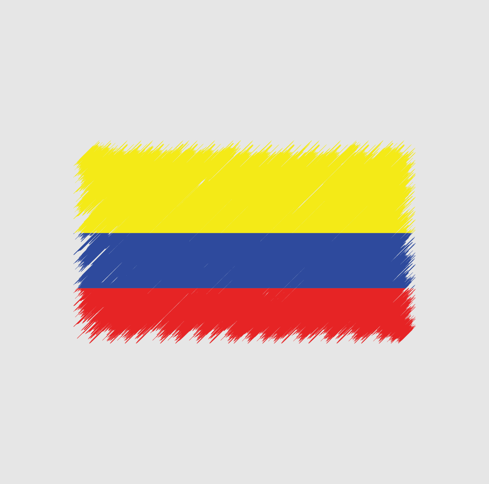

# Too Hot To Handle Team
HW#1 - GIT & GitHub ( Exploring Workflow Concepts )

## *Chanya Chumdee TM#1*
My name is Chanya Chumdee [ Yaya ], I'm from Thailand. I'm interested in web design, this is a link to my [personal site](https://ychanya.github.io/Personal-site/).

### ***My hobbies are***
1. Travelling
2. Take a picture
3. Go to the park
4. Music
5. Lego collection

### ***My skills***
- HTML
- CSS
- Management

### ***What I like***
- Natural lover
- Horror movies
- A dog person
- Bubble tea
- Spicy food

## *Juliana Gambuzza TM#2*

*my name is juliana gambuzza 
and  I have 23 years old*

 **I'm from Colombia**

### ***I love sports, I play:***
- tennis
- voleyball
- under water hockey
    - I know it is a weird sport that no one have heard about 
    - [video of what is Under Water Hockey](https://www.youtube.com/watch?v=JoiUTu4emcE)

### ***My hobbies are***
1. Cook, love to do Colombian dishes 
2. Travel to new cities, towns, contries
3. Watch movies 
4. Play board games with my family and friends

### ***My skills***
- Creativity 
- Problem solving 
- Adaptability 
- Empathy 
- Supportive

### ***What I like***
- create and design things
- paint 
- Music 
- Quality time with people I love

**CONTRIBUTING**
1. Fork it!
2. Create your feature branch: git checkout -b my-new-feature
3. Commit your changes: git commit -am 'Add some feature'
4. Push to the branch: git push origin my-new-feature
5. Submit a pull request :D

**HISTORY**

September 25th, 2024

**CREDITS**

Chanya Chumdee
Juliana Gambuzza
 
**License**

MIT 
 
